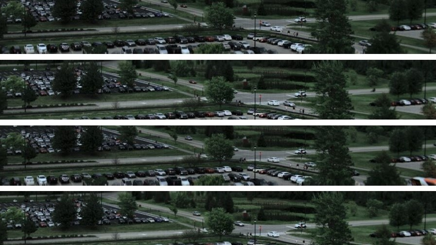

# CVPR2022-Semi-Supervised Hyperspectral Object Detection Challenge-Solution

This repository is an open source sharing of the CVPR2022-SSHODC solution

## 1. Introduction

Semi-supervised learning has developed into a highly researched problem as it minimizes the labeling costs while still achieving performance levels comparable to a fully labeled dataset. However, most semi-supervised learning algorithms are based on pre-trained models on ImageNet and are thus challenging to port to other image domains, especially those with more than three bands.

In this competition, we present the application of a newly acquired dataset collected from a university rooftop with a hyperspectral camera to perform object detection. Different scales during training can help the model adapt to targets of various sizes and obtain robustness to size. One obvious benefit of multi-scale training is that it does not increase reasoning time.



## 2. Solution

### 2.1 Data analysis

The data provided by this competition includes training sets and test sets, but only 10 % of the data in the training set is labeled data. Consider using all labeled data to transfer the pre-trained model, and using semi-supervised learning to use all labeled and unlabeled data. 

However, because the verification set provided by the competition also has no label, the verification scheme provided by the competition side is to submit the verification result to the server and then feedback the AP score. However, this will spend a lot of time on the parameter adjustment process, so the author considers dividing 10 % of the labeled data in the training set into a part as the verification set. At the same time, considering that the training set for transfer learning may be smaller and affect the effect, the k-fold cross-validation method is used to construct the local verification set.

### 2.2 Model selection

The target detection model includes the backbone network of image feature extraction and the overall detection model framework. 

#### 1. Detection model framework selection 

By using the MMdetection framework, we quickly deployed several SOTA target detection models and all used the baseline-MobileNetV2 of backbone recommended by the competition. Considering that there is no requirement for detection speed in the competition rules, we only consider the accuracy of the model. 

After using all labeled data for transfer learning, we submit the prediction results of the test set to the server to obtain the prediction accuracy. The test results of several state-of-the-art single-model detectors on the test dataset are shown in the table below.

| Object Detection Framework |  Backbone   | AP Score |
| :------------------------: | :---------: | :------: |
|        Faster R-CNN        | MobileNetV2 |   36.2   |
|       Cascade R-CNN        | MobileNetV2 |   42.8   |
|          YOLO V5           | MobileNetV2 |          |
|          SSD_513           | MobileNetV2 |          |

It can be seen that the two-stage object detection model still has greater advantages in accuracy. Both Faster R-CNN and Cascade R-CNN can be taken into account. If integrated learning can be performed, these two models can be used.

#### 2. Backbone selection

In the competition rules, the number of parameters and the amount of calculation are limited to the backbone of the model, which must not exceed MobileNet V2. We replaced the backbone in the detection model with the common ResNet101 and ResNeSt, and measured the amount of calculation and parameters of the model. The results are as follows.

| Object Detection Framework |        Backbone         | AP Score |  FLOPS  | Parameters |
| :------------------------: | :---------------------: | :------: | :-----: | :--------: |
|        Faster R-CNN        | MobileNet V2 (baseline) |  24.57   | 161.26G |   14.11M   |
|        Faster R-CNN        |        ResNet101        |    -     | 203.16G |   36.02M   |
|        Faster R-CNN        |        ResNet50         |  23.04   |    -    |     -      |
|        Faster R-CNN        |        ResNeSt50        |   29.8   | 217.28G |   42.62M   |
|       Cascade R-CNN        | MobileNet V2 (baseline) |  34.44   | 405.47G |   31.68M   |
|       Cascade R-CNN        |        ResNeSt50        |  37.28   | 461.08G |   52.92M   |
|       Cascade R-CNN        |       ResNeSt101        |  47.56   | 499.68G |   95.84M   |

It can be seen that the commonly used feature extraction Backbone has more parameters and calculations than MobileNet V2, so we choose MobileNet V2 as Backbone. 

However, because the prediction accuracy of Faster R-CNN and Cascade R-CNN is quite different, and backbone has no alternative, model integration is not considered.

### 2.3 Semi-supervised learning-Pseudo Label

Because the competition provides a data set that contains a large amount of unlabeled data, in order to better use these unlabeled data, consider using pseudo-label methods for semi-supervised learning. 

Firstly, transfer learning is performed on the pre-trained model using 10 % labeled data of the training set. Then use the model to predict all unlabeled data. The confidence threshold is set, and the prediction results larger than the confidence threshold are selected as the pseudo labels of the data and added to the training set. 

Then use the training set after adding pseudo label expansion to train, and repeat the above operation, iteratively update the model parameters.

### 2.4 Data processing

Data augmentation is divided into two stages. The first stage is strong data augmentation, and the second stage is weak data augmentation.

#### 1. Stage one: weak data augmentation

When using labeled data to transfer the pre-trained model, we use weak data augmentation. This is because : 

- Considering the particularity of the target detection task, because the data is enhanced while moving the bounding box. Many data augmentation methods commonly used in image classification are not suitable for target detection, so only some weak data augmentation methods can be used, such as graphic geometric transformation, brightness adjustment, contrast adjustment, color adjustment, etc. 
- All the data in stage one are correctly labeled and do not want to change too much, which affects the effect of transfer learning. 

The experimental results are as follows. All experiments use the model configuration of Faster R-CNN + MobileNet V2.

|          Method           |  AP(val)  |
| :-----------------------: | :-------: |
|  (a)BrightnessTransform   |   31.98   |
|       (b)translate        |   28.17   |
|         (c)shear          |   26.81   |
|         (d)rotate         |   25.46   |
| **(a) + (b) + (c) + (d)** | **35.07** |
|         (a) + (b)         |   24.95   |

Finally, we only select `BrightnessTransform + translate + shear + rotate` as the data augmentation method in phase one.

#### 2. Stage two: Strong data augmentation

After adding pseudo-label data in the training set, we use strong data augmentation on the data. This is because : 

- The training set after adding pseudo-label data is not ' 100 % correct ', and there are some mislabeled samples. In order to avoid the model updating parameters in the wrong direction, we use strong data enhancement, including Gaussian smoothing, sharpening and other operations. In order to reduce the impact of training data on the model 

- From another point of view, the quality of the data set after adding pseudo-labels is low, but the scale is expanded several times. From the perspective of sample quality distribution balance, we use strong data enhancement to weaken some features of low-quality large databases, and use weak data enhancement to retain as many features of high-quality small databases as possible to improve the model training effect.

### 2.5 **Multi-scale Training & Test**

In the target detection task, using different scales of image input during training can help the model adapt to targets of various sizes and obtain robustness to size. And multi-scale training does not increase the inference time. 

Multi-scale Test is that when predicting a picture, it is first scaled to multiple scales, then predicted separately, and the prediction result is then scaled back to the original size for maximum suppression(NMS).

## 2. Prerequisites

### 2.1 Hardware & Software

- Ubuntu 18.04.3 LTS

- GPU: 2 * NVIDIA 3090, Memory: 24 G
- CPU: AMD EPYC 7543 32-Core Processor
- Python == 3.8

- torch == 1.8.1+cu111
- trochvision == 0.9.1+cu111
- mmcv-ful == 1.5.1
- mmdet == 2.24.1

### 2.2 Data Preparation

In the competition, we only use the dataset **RIT-HS20** which is collected from a university rooftop with a hyperspectral camera. It can be downloaded from [here](https://drive.google.com/drive/folders/1MmLmo4LYWqt3Wc5ZohrpaQjKlVorl6Wy).

Please make sure the dataset is placed as shown below. 

```text
├── dataset
│   ├── RIT-HS20
│   │   ├── annotationsjson
│   │   │   ├── instances_train_s10.json
│   │   │   ├── instances_test_id.json
│   │   │   ├── val_no_label.json
│   │   │   ├── test.json
│   │   ├── masks
│   │   ├── spectral
```

### 2.3 Model Preparation

Get pre-trained models from [MMdetection](https://github.com/open-mmlab/mmdetection)

## 3. Train the model

Divided into two stages of training, the code file used is `tools/train.py` and `tools/test.py` . The configuration file used is `Cascade_RCNN_MobileNetV2.py` and `Cascade_RCNN_MobileNetV2_aug.py`

`tools/train.py` : For model training

`tools/test.py` : For model prediction

`Cascade_RCNN_MobileNetV2.py` : Configure the 1st stage model training

`Cascade_RCNN_MobileNetV2_aug.py` : Configure the 2nd stage model training

### 1. 1st stage

Pre training the model with labeled data, and generate pseudo labels for unlabeled data

1. Run `tools/train.py` under the configuration of  `Cascade_RCNN_MobileNetV2.py` to pre-train the model


```shell
python tools/train.py Cascade_RCNN_MobileNetV2.py \
		--work-dir ./work_dirs/xxx
```

2. Run `tools/test.py` under the configuration of  `Cascade_RCNN_MobileNetV2.py` to generate pseudo labels

```shell
python tools/test.py Cascade_RCNN_MobileNetV2.py dataset/first.pth \
		--format-only \
		--pseudo_label

# Store pseudo labels
mv predict_result.json dataset/RIT-HS20/annotationsjson/
```

### 2. 2nd stage

filter for pseudo labels and conduct the second round of model training using the expanded dataset

1. Run `tools/pseudo1.py` and `tools/pseudo2.py` to filter pseudo labels

```shell
python tools/pseudo1.py		
python tools/pseudo2.py
```

2. Run `tools/train.py` under the configuration of  `Cascade_RCNN_MobileNetV2_aug.py` to train the model with pseudo labels data

```shell
python tools/train.py Cascade_RCNN_MobileNetV2_aug.py \
		--work-dir ./work_dirs/xxxx
```

## 4. Evaluation

Run `tools/test.py` under the configuration of  `Cascade_RCNN_MobileNetV2.py` . And the `predict_result.json` will be generated in the current workspace directory.

```shell
python tools/test.py Cascade_RCNN_MobileNetV2_aug.py dataset/final.pth \
		--format-only
```

## 5. References

1. Cai Z, Vasconcelos N. Cascade r-cnn: Delving into high quality object detection[C]//Proceedings of the IEEE conference on computer vision and pattern recognition. 2018: 6154-6162.
1. Lee D H. Pseudo-label: The simple and efficient semi-supervised learning method for deep neural networks[C]//Workshop on challenges in representation learning, ICML. 2013, 3(2): 896.
1. Buslaev A, Iglovikov V I, Khvedchenya E, et al. Albumentations: fast and flexible image augmentations[J]. Information, 2020, 11(2): 125.
1. Ren S, He K, Girshick R, et al. Faster r-cnn: Towards real-time object detection with region proposal networks[J]. Advances in neural information processing systems, 2015, 28.
1. Howard A, Zhmoginov A, Chen L C, et al. Inverted residuals and linear bottlenecks: Mobile networks for classification, detection and segmentation[J]. 2018.
1. Howard A, Sandler M, Chu G, et al. Searching for mobilenetv3[C]//Proceedings of the IEEE/CVF international conference on computer vision. 2019: 1314-1324.
1. Lin T Y, Dollár P, Girshick R, et al. Feature pyramid networks for object detection[C]//Proceedings of the IEEE conference on computer vision and pattern recognition. 2017: 2117-2125.

## 6. Acknowledgment

Thanks to [MMdet](https://github.com/open-mmlab/mmdetection) for Pytorch implementation.
